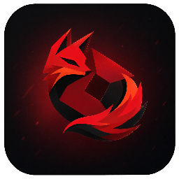

<p align="center">
  
</p>

# ZeFoX Presence Bridge

ZeFoX Presence Bridge is the optional Windows app that lets the ZeFoX browser extension show Discord Rich Presence while you use Roblox.

## Download

Download the latest setup file from the official ZeFoX RPC releases:

```text
https://github.com/VZefoq/ZeFoX-RPC/releases/latest/download/ZeFoX-Presence-Bridge-Setup.exe
```

Run the setup file and follow the installer.

## What it does

- Connects ZeFoX to Discord Rich Presence.
- Runs locally on `127.0.0.1:3030`.
- Starts automatically when the app opens.
- Keeps running from the Windows tray when the window is closed.
- Lets you enable or disable the bridge, Rich Presence, and account display.

Discord desktop must be open for Rich Presence to appear.

## Updates

The app checks for updates automatically after it starts.

If an update is available, ZeFoX Presence Bridge downloads it and asks you to restart the app when it is ready.

If you run the setup file while the latest version is already installed, it will say that you already have the latest version instead of offering to uninstall.

## Uninstalling

To uninstall, use Windows Settings:

```text
Settings > Apps > Installed apps > ZeFoX Presence Bridge > Uninstall
```

## Troubleshooting

- If Discord Rich Presence does not appear, make sure Discord desktop is open.
- If the extension cannot connect, make sure ZeFoX Presence Bridge is running.
- If Windows SmartScreen appears, choose `More info`, then `Run anyway`, but only if you downloaded the setup from the official ZeFoX site or GitHub release.
